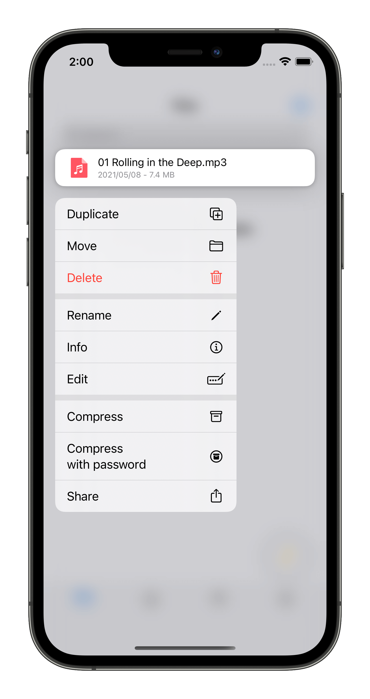

# Files

File Management is the core feature of Filebox. We can manage local files as well as remote files using Filebox. The file system of Filebox is open, that means you can access the files using any other app. You can even manage files using Finder app.

## Add files

Add files to Filebox can be done in various ways:

- Via WiFi transfer
- Via AirDrop
- Via external "Files" app
- Via Remote Server (SMB/NAS/FTP/WebDAV)
- Via macOS Finder

After you added files to Filebox, you can play with files!

## Play with files

You can do lots with your files:

- Play (usually play video and music)
- Edit
- View Info (MD5/SHA1/SHA256...)
- Move
- Delete
- Archive/Unachive
- Share
- And more...

## Remote Server

You can also manage your remote files using Filebox. Following list describes currently supported operations:

- Play videos
- Play audios
- Upload files
- Move
- Delete