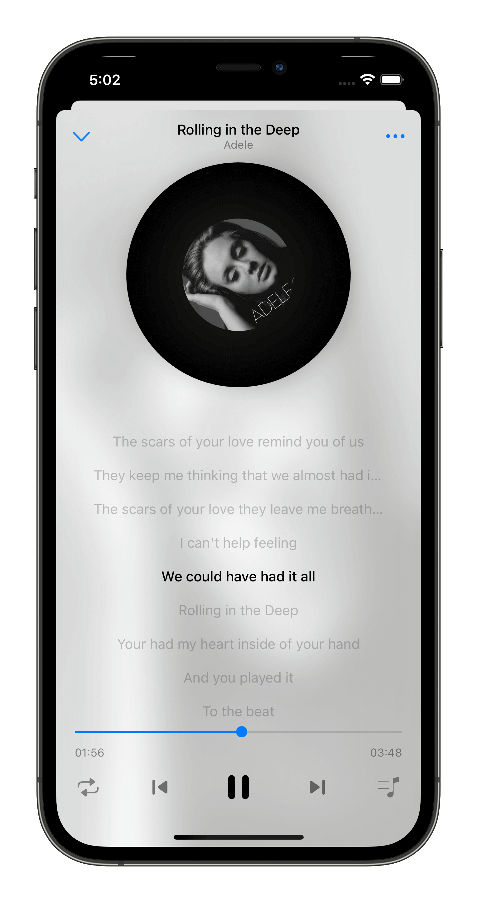
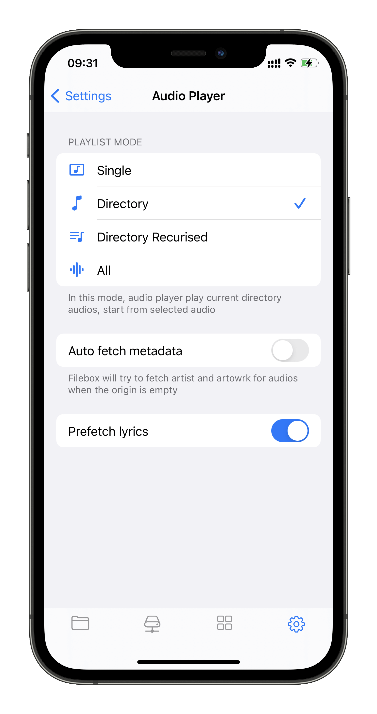
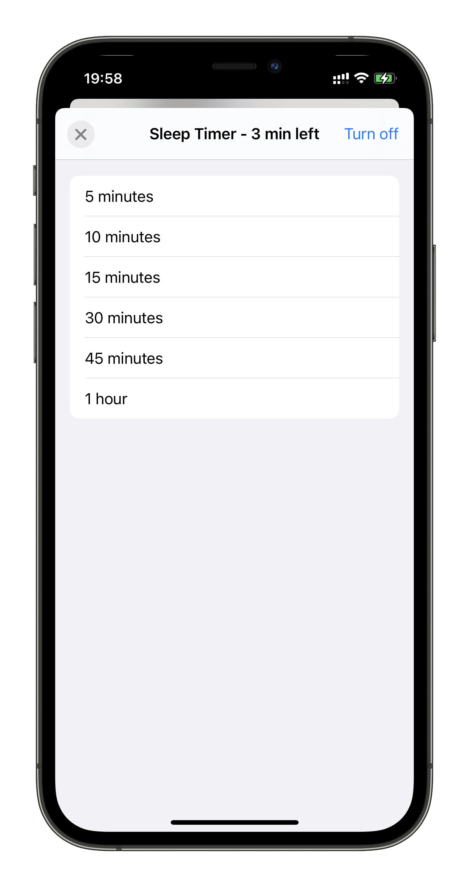

# Music Player

Filebox provides a beautiful music player to play local music files.

## Playlist

Filebox provides folder based playlist which you can gather you favorite songs into the same folder.

You can also customize the default behavior of the playlist mode:

- Single - Play the song you tapped
- Directory - Play the songs in the folder
- Directory Recurised - Play the songs in the folder and recurised folders
- All - Play all songs

## Edit metadata

You can edit the metadata information with Filebox. Currently you can eidt following metadata:

- Artist
- Album Name
- Artwork

## Sleep Timer

Sleep timer is very useful when you want to listen music when you are going to sleep. You can setup a timer to stop the music playback.

