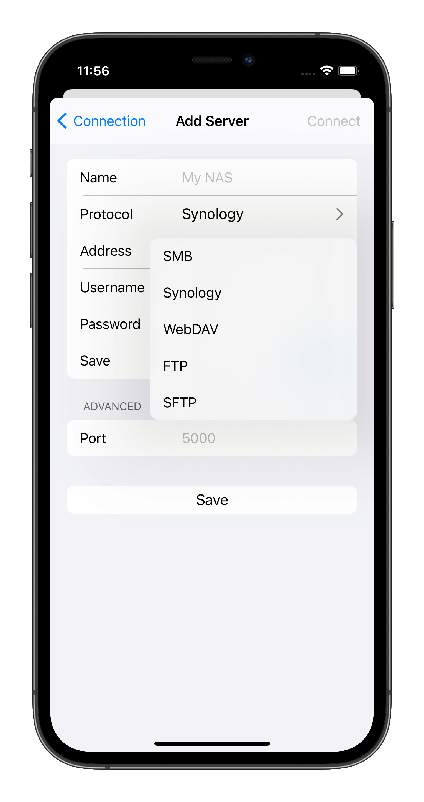
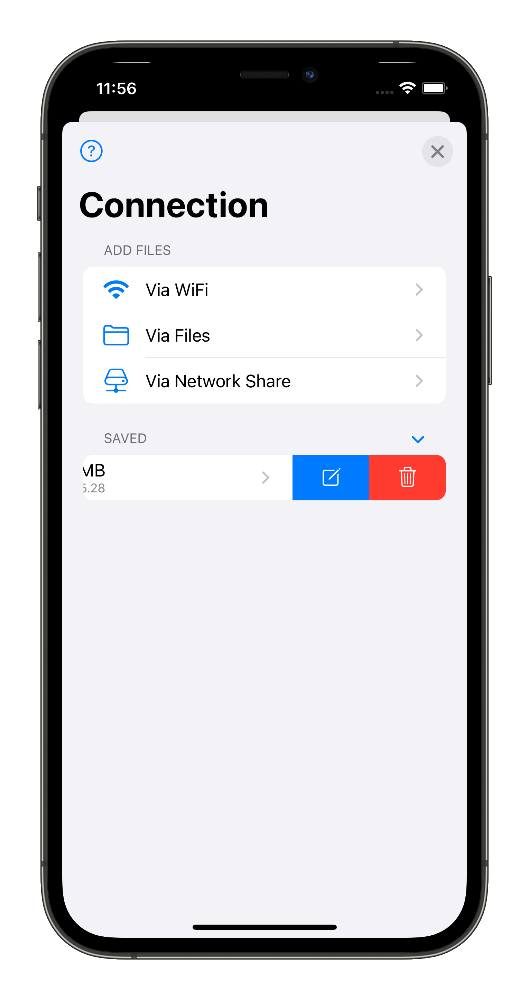

# Connect

Connect to remote server requires some necessary information depends on what protocol you choose. 

By filling the form information, you can connect to your remote server.

## Edit saved accounts

You can edit saved accounts in Connection tab by swiping left at the saved account cell.

